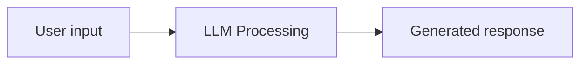

# AI Agents

AI agents are simply workflows, or DAGs, or just graphs if included on a loop. Most steps in these workflows should be regular code, not LLM calls.

## Fundamental Building Blocks

### 1. Intelligence

This is the only truly **AI** component. Without it you just have regular software.

- [Cookbook - LLM Completion](./notebooks/python/generative-ai/llm-completion.md)

### 2. Memory

LLMs don't remember anything from previous messages. Without memory, each interaction starts from scratch because LLMs are stateless.

### 3. Tools

The LLM call itself is limited just to text, but you want to do more than that, such as API calls and interact with databases.

- [Cookbook - LLM Tools](./notebooks/python/generative-ai/llm-tools.md)

### 4. Validation

LLMs are probabilistic and can produce inconsistent outputs, make sure that the LLM return structured output A.K.A JSON format that matches your expected schema. If does not you can send it back to the LLM to fix it. Most commonly used tools are **Pydantic** (Python) and **Zod**: (Javascript).

### 5. Control

You don't want your LLM making every decision. Use deterministic control flows like if/else statements and routing logic. This is normal business logic written in any kind of application.

Some times preferred instead of tools why it can be a little difficult to understand why the LLM have chosen that tool. With routing based control flows and structured outputs we can define reasoning output properties so it is easier to debug.

- [Cookbook - Control Flow](./notebooks/python/generative-ai/llm-control-flow.md)

### 6. Recovery

Things may go wrong. APIs will be down, LLMs will hallucinate and rate limits will hit you. You need try/catch blocks, retry logic with backoff, and fallback responses when stuff breaks. This is just standard error handling that you'd implement in any production system.

## AI Agents vs. Workflows

| Feature                       | 🟢 Agent                                 | 🔴 Workflow                                    |
| :---------------------------- | :--------------------------------------- | :--------------------------------------------- |
| **How many LLM calls?**       | Many                                     | Many                                           |
| **Who decides when to stop?** | The LLM                                  | Predetermined Steps                            |
| **Good for?**                 | When the path to the solution is unclear | When the path to the solution is known upfront |

## References

- [Video - building-effective-agents, Anthropic](https://www.anthropic.com/engineering/building-effective-agents)
- [Video - How to Build Reliable AI Agents](https://www.youtube.com/watch?v=T1Lowy1mnEg&t=478s)
- [Video - Most devs don't understand what agents are](https://www.youtube.com/watch?v=AtYtuVTZCQU)
