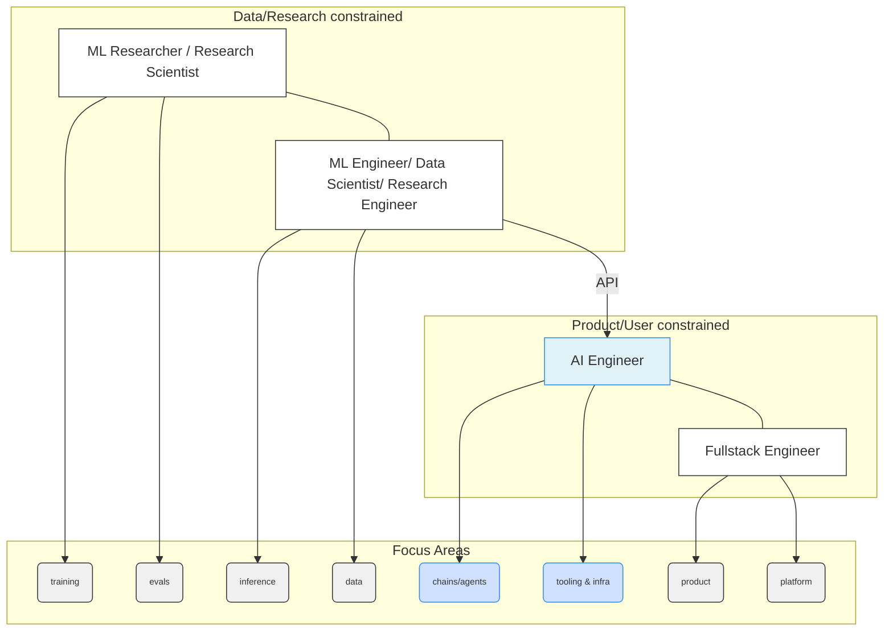

# Professions

```mermaid
graph TD
    subgraph Data/Research constrained
        MR[ML Researcher / Research Scientist]
        MLED[ML Engineer/ Data Scientist/ Research Engineer]
    end

    subgraph Product/User constrained
        AIE[AI Engineer]
        FE[Fullstack Engineer]
    end

    subgraph Focus Areas
        T(training)
        E(evals)
        I(inference)
        D(data)
        C(chains/agents)
        TI(tooling & infra)
        P(product)
        PL(platform)
    end

    MR --- MLED
    MLED -- API --> AIE
    AIE --- FE

    MR --> T
    MR --> E

    MLED --> I
    MLED --> D

    AIE --> C
    AIE --> TI

    FE --> P
    FE --> PL

    style MR fill:#fff,stroke:#333
    style MLED fill:#fff,stroke:#333
    style AIE fill:#e0f2f7,stroke:#318ce7
    style FE fill:#fff,stroke:#333

    style T fill:#f0f0f0,stroke:#333,font-size:10px
    style E fill:#f0f0f0,stroke:#333,font-size:10px
    style I fill:#f0f0f0,stroke:#333,font-size:10px
    style D fill:#f0f0f0,stroke:#333,font-size:10px
    style C fill:#d0e0ff,stroke:#318ce7,font-size:10px
    style TI fill:#d0e0ff,stroke:#318ce7,font-size:10px
    style P fill:#f0f0f0,stroke:#333,font-size:10px
    style PL fill:#f0f0f0,stroke:#333,font-size:10px
```
