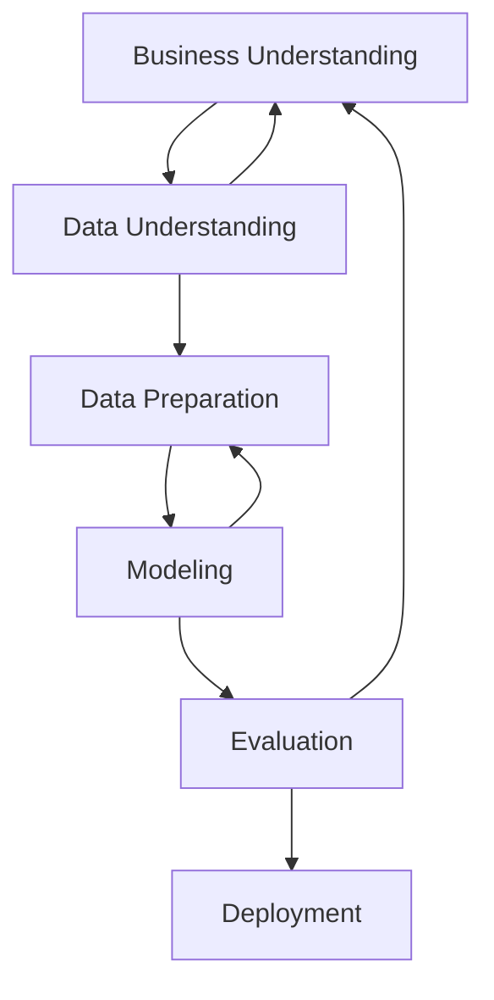

# CRISP-DM

The Cross-Industry Standard Process for Data Mining (CRISP-DM) is a widely used methodology for data mining and analytics projects. It provides a structured approach to planning and executing data mining projects, ensuring that they are systematic and repeatable. The CRISP-DM process consists of six main phases:

1. **Business Understanding**: This phase focuses on understanding the project objectives and requirements from a business perspective. It involves defining the problem, identifying the goals, and determining the success criteria.
2. **Data Understanding**: In this phase, data is collected and explored to gain insights into its quality and characteristics. It involves activities such as data collection, data description, data exploration, and data quality assessment.
3. **Data Preparation**: This phase involves preparing the data for analysis. It includes tasks such as data cleaning, data transformation, data integration, and data reduction.
4. **Modeling**: In this phase, various modeling techniques are selected and applied to the prepared data. It involves selecting modeling algorithms, building models, and evaluating their performance.
5. **Evaluation**: This phase focuses on assessing the models to ensure they meet the business objectives. It involves evaluating the model results, reviewing the process, and determining the next steps.
6. **Deployment**: The final phase involves deploying the model into a production environment. It includes activities such as planning deployment, monitoring the model, and maintaining the model over time.

