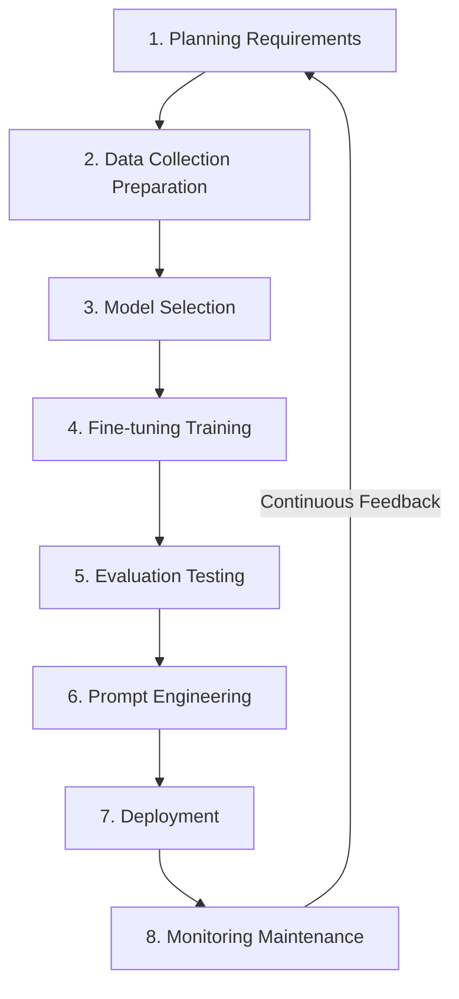

```mermaid
graph TD
    A[1. Planning Requirements] --> B[2. Data Collection Preparation]
    B --> C[3. Model Selection]
    C --> D[4. Fine-tuning Training]
    D --> E[5. Evaluation Testing]
    E --> F[6. Prompt Engineering]
    F --> G[7. Deployment]
    G --> H[8. Monitoring Maintenance]
    H -->|Continuous Feedback| A
```
