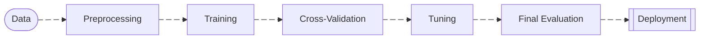

# Evaluation - K-Fold Cross Validation

K-Fold is used to estimate how well the model generalizes before deployment. It repeatedly splits the dataset into training and validation sets. Instead of doing one _train/test split_, the dataset is split in equal parts(folds) and the model is trained K times using different train/validation splits.

- Test dataset must not be used in Cross Validation to avoid **Data Leakage**
- For classification problems, specially imbalanced datasets use **Stratified K-Fold**
- In large-scale ML pipelines, K-Fold is often too expensive.



It helps detect:

• overfitting
• data leakage
• unstable models

## Example

- Training:

| Fold | Train On      | Validate On |
| ---- | ------------- | ----------- |
| 1    | folds 2-5     | fold 1      |
| 2    | folds 1,3-5   | fold 2      |
| 3    | folds 1-2,4-5 | fold 3      |
| 4    | folds 1-3,5   | fold 4      |
| 5    | folds 1-4     | fold 5      |

- Evaluation:

| Fold | Accuracy |
| ---- | -------- |
| 1    | 0.82     |
| 2    | 0.79     |
| 3    | 0.84     |
| 4    | 0.80     |
| 5    | 0.83     |

- Computation:

```py
mean accuracy = 0.816
std = 0.018
# The model will likely achieve ~81.6% accuracy on new data.
```

The mean metric is your best estimate of how the model will perform on unseen data and std tells you model stability. A low _std_ means that model perform consistently cross folds, so is desired to achieve a high mean with low variance.
