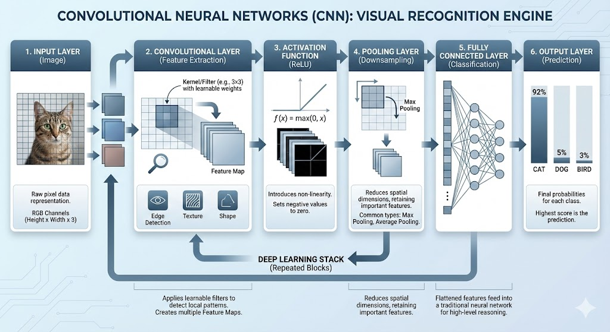

# Convolutional Neural Networks (CNNs)

When data does not align into columns and rows, such as images, audio, or video, Convolutional Neural Networks (CNNs) are often the preferred architecture.

They receive a source image or another data source, break into smaller chunks called convolutions (using filters/kernels), and process these chunks to extract features.

- Feature-location invariance: CNNs can recognize patterns regardless of their position in the input data.
- Natural language processing (NLP) tasks can also benefit from CNNs, especially for text classification and sentiment analysis.
- Sentence classification tasks can leverage CNNs to capture local features and patterns in text data.
- Image recognition and classification are primary applications of CNNs, where they excel at identifying objects within images.
