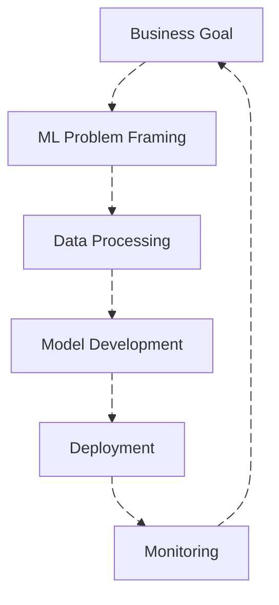
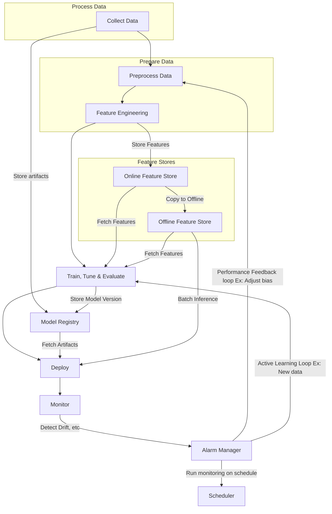

# Machine Learning Design Principles

- Ownership
- Security controls
- Fault tolerance
- Recoverability
- Reusability
- Reproducibility
- Resource optimization
- CI/CD, CT (Continuous training)
- Monitoring & Analysis
- Sustainability (minimize environment impact)

## Machine Learning Lifecycle

### Business Goal

- Discuss and agree on the level of model expandability
- Monitor model compliance to business requirements
- Validate the data permissions, privacy and license terms
- Determine key performance indicators
- Define overall return on investment (ROI) and opportunity cost

### Machine Learning Problem Framing

- Stablish Machine Learning roles and responsibilities
- Prepare an profile template
  - Document resources required
- Establish model improvement strategies
  - Experiments
  - Hyper-parameter optimization
- Establish a lineage tracker system
  - Pipelines
  - Feature Store
  - Model Registry
- Establish feedback loops across ML lifecycle phases
  - Model monitoring
- Review fairness and expandability
- Design data encryption and obfuscation
  - PII
  - Masking
- Use APIs to abstract changes from model breaking application consumption
  - API Gateway
- Adopt a machine learning microservice strategy
  - Serverless functions
  - Serverless containers
- Define relevant evaluation metrics
- Identify if machine learning is the right solution
- Consider AI services and pre-trained models

**Architecture**:

### Data Processing

- Profile data to improve quality
  - Data wrangling
  - Data exploration
- Create tracking and version control mechanisms
  - Model Registry
  - Experiments
  - Code versioning on Git
- Ensure least privilege access
- Secure data and modeling environment

#### Data Collection

- Label: Set target variable values
- Ingest: Can be stream, batch or other methods
- Aggregate: Data can come from multiple sources

#### Data Preparation

**Data Preprocessing**:

- Clean: Missing data & Outliers
- Partition: Partition by dimension to efficient access
- Scale: Should use a distributed system like spark?
- Unbias & Balance: Deal with over representation of classes
- Augment: Add new or additional data

**Feature Engineering**:

- Feature Selection: Which features are most important
- Feature Transformation: Normalization, Encoding, etc
- Feature Creation: Transform the features you have in another ways
- Feature Extraction: Extract information from an address field
