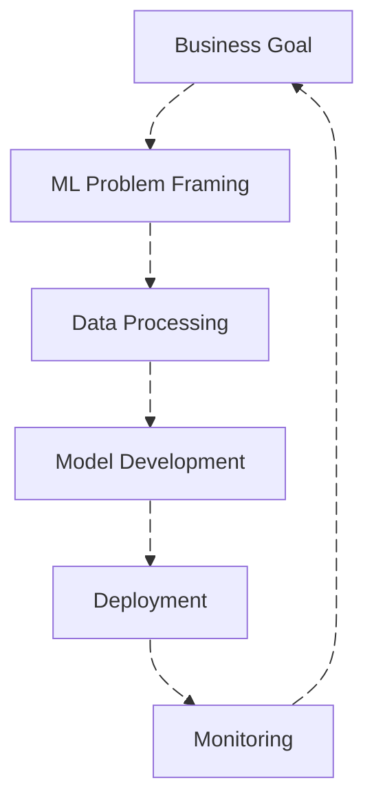
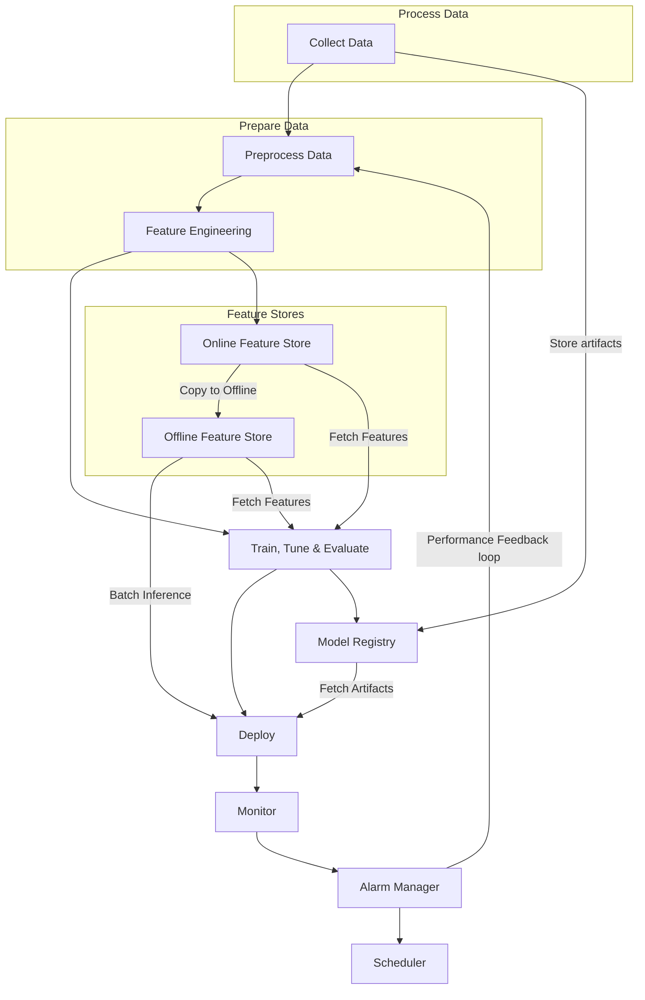

# Machine Learning Design Principles

- Ownership
- Security controls
- Fault tolerance
- Recoverability
- Reusability
- Reproducibility
- Resource optimization
- CI/CD, CT (Continuous training)
- Monitoring & Analysis
- Sustainability (minimize environment impact)

## Machine Learning Lifecycle

### Business Goal

- Discuss and agree on the level of model expandability
- Monitor model compliance to business requirements
- Validate the data permissions, privacy and license terms
- Determine key performance indicators
- Define overall return on investment (ROI) and opportunity cost

### Machine Learning Problem Framing

