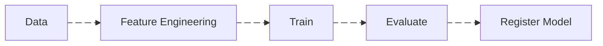

# Training

A machine learning model is essentially a **mathematical function** that learns patterns from historical data so it can make predictions about new, unseen data.

It takes **features** (inputs) and produces a **prediction** (output).

Example:

| Age | Income | Loan Default |
| --- | ------ | ------------ |
| 25  | 3000   | No           |
| 45  | 9000   | No           |
| 30  | 2000   | Yes          |

The model learns patterns like:

> "People with lower income and certain age ranges have a higher probability of default."

After training, when a new example arrives, the model uses the learned patterns to estimate the outcome.

The dataset is typically split into _three parts_ to ensure the model learns properly and **generalizes** to new data.

- Train
- Validation (optional but common)
- Test

## Dataset Splits

### Train

The training dataset is used to teach the model the patterns in the data.

During training, the model:

1. Makes a prediction
2. Compares the prediction to the correct answer (label)
3. Calculates the **error** (loss)
4. Adjusts its internal parameters to reduce that error

This process repeats many times until the model learns stable patterns.

!!! note "Note"

    The model is not memorizing the data.
    It is adjusting parameters to minimize prediction error.

Example:
A logistic regression model adjusts its **weights** so the predicted probability of default becomes closer to the real label.

### Validation

The validation dataset is used to evaluate the model **during training**.

It helps answer questions like:

- Is the model improving?
- Is the model **overfitting** the training data?
- Which hyperparameters work best?

The validation set is **never** used to update the model weights.

It is only used to **measure** performance and guide decisions like:

- Choosing hyperparameters
- Early stopping
- Selecting the best model version

Example hyperparameters:

- learning rate
- number of trees
- tree depth
- regularization strength

### Test

The test dataset is used for the **final** unbiased evaluation of the model.

It simulates **real world** unseen data.

!!! note "Note"

    The test dataset must never influence training decisions.

Otherwise the model may **leak** information and the evaluation becomes unreliable.

The test metric represents the expected **production** performance.

## Choosing the Algorithm

Choosing the algorithm means selecting the **type** of mathematical model that will learn from the data.

Different algorithms learn patterns in different ways.

Examples:

| Algorithm                             | Typical Use                        |
| ------------------------------------- | ---------------------------------- |
| Linear Regression                     | Predict continuous numbers         |
| Logistic Regression                   | Binary classification              |
| Decision Trees                        | Interpretable rule-based models    |
| Random Forest                         | Robust general-purpose model       |
| Gradient Boosting (XGBoost, LightGBM) | High performance tabular data      |
| Neural Networks                       | Complex patterns like images, text |

## How to Choose an Algorithm

### 1. Problem Type

The task determines the model family.

| Problem         | Example             | Model Type                         |
| --------------- | ------------------- | ---------------------------------- |
| Regression      | Predict house price | Linear regression, XGBoost         |
| Classification  | Fraud detection     | Logistic regression, Random Forest |
| Ranking         | Search results      | Gradient boosting                  |
| NLP             | Text classification | Transformers                       |
| Computer Vision | Image detection     | CNN                                |

### 2. Data Characteristics

The nature of the dataset strongly influences model choice.

Important questions:

- How **large** is the dataset?
- Are features mostly **numerical** or **categorical**?
- Is the data tabular, image, text, or time-series?

Example:

Tabular business datasets usually perform best with:

- Gradient Boosting
- Random Forest

Deep learning is often unnecessary.

### 3. Interpretability Requirements

Some domains require models to be **explainable**.

Examples:

| Industry   | Requirement                   |
| ---------- | ----------------------------- |
| Finance    | Must explain credit decisions |
| Healthcare | Must justify predictions      |
| Insurance  | Regulatory transparency       |

In these cases engineers may prefer:

- Logistic Regression
- Decision Trees
- Explainable Gradient Boosting

Instead of black-box deep learning.

### 4. Performance vs Complexity

Some models are simple but fast.

Others are powerful but complex.

Example trade-off:

| Model               | Pros                  | Cons               |
| ------------------- | --------------------- | ------------------ |
| Logistic Regression | Simple, interpretable | Limited complexity |
| Random Forest       | Good performance      | Larger model       |
| Gradient Boosting   | Excellent accuracy    | Slower training    |
| Neural Networks     | Extremely powerful    | Hard to interpret  |

A good cientist starts **simple** first and increases complexity only if necessary.

## Training the Model

Once the algorithm is chosen, the model must learn the **parameters** that best fit the data.

Training generally follows this loop:

1. Input features into the model
2. Model produces a prediction
3. Compare prediction with the true label
4. Compute a **loss function**
5. Update model parameters to reduce loss

This process is called **optimization**.

Example:

Gradient Descent is the algorithm used to **train** many ML models by **minimizing** prediction **error** (loss).

## Evaluating the Model

After training, the model is evaluated using metrics that match the business problem.

Examples:

| Task            | Metrics                         |
| --------------- | ------------------------------- |
| Classification  | Accuracy, Precision, Recall, F1 |
| Fraud Detection | ROC-AUC, Precision-Recall       |
| Regression      | RMSE, MAE                       |
| Ranking         | NDCG                            |

The goal is not only _high performance_, but **stable** performance on _unseen data_.

A model that performs extremely well on training data but poorly on validation/test data is **overfitting**.

## Model Versioning

Every training run must be **reproducible** and **traceable**.

A training pipeline should version:

- Code (Git)
- Dataset (data version)
- Features / transformations
- Hyperparameters
- Model artifact
- Evaluation metrics

This guarantees that any model can be **retrained or audited** later.

Models are typically stored in a **Model Registry**, which tracks model versions and lifecycle stages.

## Automated Training Pipeline (CI/CD)

In production systems, training runs through an **automated** pipeline, not manual scripts.

Typical pipeline:

Key practices:

- **CI (Continuous Integration)**
    - Validates training code
    - Runs tests and data checks
    - Ensures pipeline reproducibility

- **CD (Continuous Delivery)**
    - Promotes models automatically if **metrics pass thresholds**
    - Registers model in the **Model Registry**
    - Triggers deployment workflows

Example flow:

## Summary

Training a model is not just running an algorithm.

It is a **systematic process** of:

1. Preparing data
2. Choosing the right algorithm
3. Training and tuning the model
4. Evaluating generalization
5. Selecting the best version for production

This disciplined approach ensures the model performs reliably when deployed in real-world systems.
