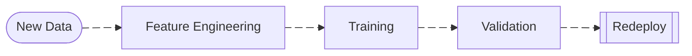

# Machine Learning Monitoring

Core checks:

1. Data Drift
2. Prediction Drift
3. Performance Drop
4. Data Quality Issues

First requirement: log everything needed for monitoring.

At inference time capture:

- timestamp
- model_version
- request_id
- input_features
- prediction
- prediction_probability

Example:

```json
{
    "timestamp": "2026-03-07T10:22:11",
    "model_version": "fraud_model_v3",
    "features": {
        "amount": 350.2,
        "country": "BR",
        "device_type": "mobile"
    },
    "prediction": 1,
    "probability": 0.87
}
```

Example:

```py
def predict(features):

    pred, prob = model.predict(features)

    log_event = {
        "timestamp": now(),
        "model_version": MODEL_VERSION,
        "features": features,
        "prediction": pred,
        "probability": prob
    }

    kafka_producer.send("model_inference_logs", log_event)

    return pred
```

## Data/Feature Quality

Catch data pipeline bugs.

| metric          | example               |
| --------------- | --------------------- |
| missing values  | feature suddenly null |
| range violation | age < 0               |
| category shift  | new country appears   |

Pseudo code:

```py
missing_rate = df["amount"].isnull().mean()

if missing_rate > 0.05:
    alert("feature amount missing")
```

## Performance

- Regression: RMSE, MAE, R²
- Classification: Accuracy, Precision, Recall, F1-score, AUC-ROC

Some problems get labels later.

Example:

| Use case        | label delay |
| --------------- | ----------- |
| fraud detection | days        |
| credit default  | months      |
| recommendation  | minutes     |

1. Join prediction_logs + **ground_truth_labels**
2. Compute metrics:
    - accuracy
    - precision
    - recall
    - auc
    - f1

Pseudo code:

```py
df = join(predictions, labels)

precision = precision_score(df.y_true, df.y_pred)
recall = recall_score(df.y_true, df.y_pred)
auc = roc_auc_score(df.y_true, df.y_prob)
```

## Drift

- Data Drift: Changes in data distribution
- Concept Drift: Changes in feature target relationship
- Prediction Drift: Changes in prediction rate. Ex: fraud_rate goes from 1% to 7%

Example:

1. Pull last 10k inference logs
2. Extract features
3. Compare with training dataset distribution
4. Compute drift metric
5. Trigger alert if threshold exceeded

Common methods:

| Method                           | When Used        |
| -------------------------------- | ---------------- |
| KS test                          | numeric features |
| PSI (Population Stability Index) | banking/credit   |
| Chi-square                       | categorical      |

## Operational

Classic service monitoring.

| metric     | meaning            |
| ---------- | ------------------ |
| latency    | inference time     |
| throughput | requests/sec       |
| error rate | failed predictions |
| CPU/GPU    | resource usage     |

Example:

- p95 latency
- request rate

## Explainability

- SHAP: Feature importance
- LIME

## Bias & Fairness

- Model bias/ fairness

## Deployment type

### Batch Deployment

Based on training data or past batch predictions:

- Expected data quality
- Data distribution type (e.g., Gaussian, Poisson)
- Descriptive statistics (mean, median, mode, stddev, min, max, percentiles)

### Non-Batch Deployment

Descriptive statistics and quality:

- Calculate metrics continuously or incrementally

Statistical tests on a continuous data stream:

- Pick a window function (e.g, moving windows or without moving reference) and "compare" windows.

## Common Tools

| Layer          | Tools               |
| -------------- | ------------------- |
| logging        | Kafka, Kinesis      |
| metrics        | Prometheus          |
| monitoring     | EvidentlyAI         |
| data warehouse | Snowflake, BigQuery |
| alerts         | PagerDuty           |
| dashboards     | Grafana             |

## Retraining

Pseudo code:

```py
if drift_detected OR performance_drop:
    trigger_retraining_pipeline
```

Pipeline:


