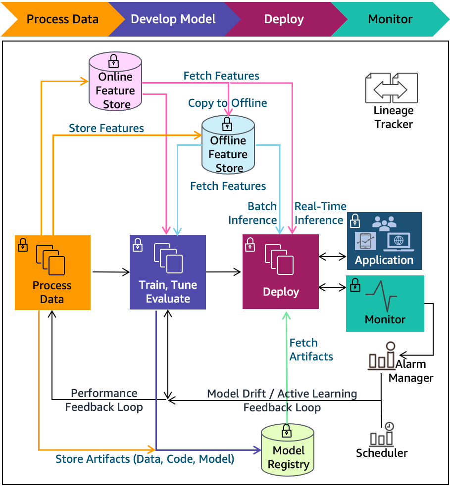

# MLOps

MLOps is a set of practices to put Machine Learning into production

## Maturity level

### 0: No MLOps

- No automation
- All code in a `Jupyter` notebook

### 1: Devops, But no MLOps

- Automated Releases
- Unit tests
- Integration tests
- CI/CD
- Ops metrics
- No experiment tracking
- No reproducibility
- Data scientists separated from engineers

### 2: Automated training

- Training pipeline
- Experiment tracking
- Model registry
- Low friction deployment, but still manual
- Data scientists work with engineers

### 3: Automated deployment

- Easy to deploy a model
- A/B tests
- Model monitoring

### 4: Full MLOps automation

- Continuous training, model is automatically retrained and deployed

## Experiment tracking

Experiment tracking is the process of keeping track of all the relevant information from an ML experiment, which includes:

- Source code
- Environment
- Data
- Model
- Hyperparameters
- Metrics

This is important to keep reproducibility and organization of the project

### Concepts

- ML experiment: the process of building a model
- Experiment run: each trial in an ML experiment
- Run artifact: any file that is associated with an ML run
- Experiment metadata
- Different from A/B testing (also called experimenting)

## References

- [mlops-maturity-model](https://learn.microsoft.com/en-us/azure/architecture/ai-ml/guide/mlops-maturity-model)
- [cd4ml](https://martinfowler.com/articles/cd4ml.html)
- [mlops-continuous-delivery-and-automation-pipelines-in-machine-learning](https://docs.cloud.google.com/architecture/mlops-continuous-delivery-and-automation-pipelines-in-machine-learning)
- [wellarchitected-machine-learning](https://docs.aws.amazon.com/pdfs/wellarchitected/latest/machine-learning-lens/wellarchitected-machine-learning-lens.pdf#machine-learning-lens)
