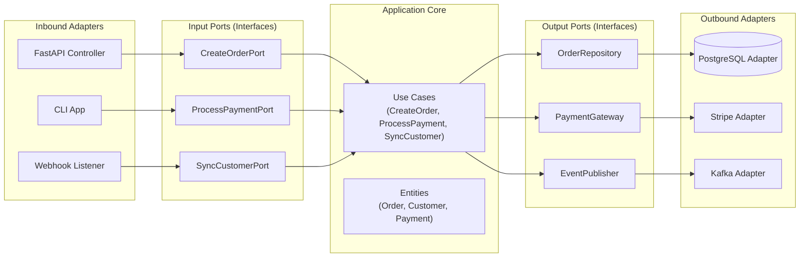

# Application Architecture - Hexagonal Architecture

## Definition

Hexagonal architecture also called _Ports and Adapters_, it is a software architecture pattern that separates business logic from external systems (database, APIs, UI, messaging, etc.) by introducing clear boundaries.

The core ideia is that the application core should not depend on any frameworks, databases or external services. Instead, external systems depends on the core.

Hexagonal architecture divides the system into three main parts:

1. Core (Domain + Application)
    - Business rules
    - Use cases
    - Domain models
    - No framework dependencies
    - No database code
    - No HTTP Controllers

2. Ports (Interfaces)
    - Ports define how the core communicates with outside world
    - There are two types of ports:
        - Driving Ports (Inbound): Interfaces that the core exposes to be called by external systems (e.g., REST API, CLI, Scheduled Jobs)
        - Driven Ports (Outbound): Interfaces that the core uses to call external systems (e.g., Repositories, Payment Gateways, Message Publishers)

3. Adapters (Implementations)
    - Adapters implement the ports to connect the core to external systems
    - Adapters depend on the core
    - The core does not depend on adapters
    - It follows dependency inversion principle



## When to use

- The system has business complexity
- You want to swap infrastructure (DB, queue, payment provider)
- You want framework independence

Should be avoid for:

- Simple CRUD applications
- Prototyping
- Simple scripts

## Pros

- Strong separation of concerns
- Testability
- Replaceable infrastructure
- Framework independence
- Cleaner code base at scale

## Cons

- More boilerplate
- Overengineering for simple applications
- Harder to juniors initially

## Examples

Ports:

```py title="ports/order_repository.py"
from typing import Protocol

class OrderRepository(Protocol):
    def save(self, order: OrderEntity) -> None: ...
```

Domain:

```py title="core/domain/order_entity.py"
class OrderEntity: ...
```

Use Cases:

```py title="core/application/use_cases/create_order_use_case.py"
class CreateOrderUseCase:
    def __init__(self, order_repository: OrderRepository): ...
```

Database Adapter:

```py title="adapters/database/postgres_order_repository.py"
class PostgresOrderRepository(OrderRepository):
def save(self, order: OrderEntity) -> None: ...
```

HTTP Adapter:

```py title="adapters/http/create_order_http_adapter.py"
class CreateOrderHTTPAdapter:
    def __init__(self, create_order_use_case: CreateOrderUseCase): ...
```
