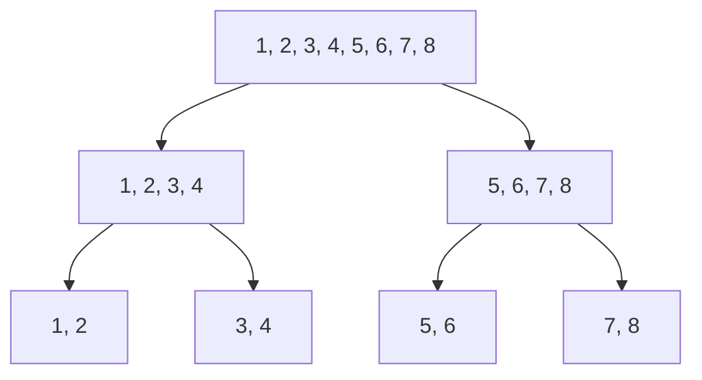

# Asymptotic Notations

Asymptotic behavior is that as X approaches infinity, the function behaves in a certain way. It is used to analyze the performance of algorithms as the input size grows. It looks for tail behavior of the function, which is more important than the behavior for small inputs.

Asymptotic analysis is preferred over computing the elapsed time for an algorithm because it provides a more general understanding of the algorithm's efficiency, independent of hardware and implementation details.

On very large inputs, the differences in performance between algorithms become more pronounced, making asymptotic analysis a valuable tool for comparing algorithms.

- Big O: Upper bound (Worst case)
- Big Omega: Lower bound (Best case)
- Big Theta: Both upper and lower bound

## Time Complexity

## Space Complexity

## Big O Notation

- O(1): Constant time complexity
- O(log n): Logarithmic time complexity
- O(n): Linear time complexity
- O(n log n): Linearithmic time complexity
- O(n^2): Quadratic time complexity
- O(n^3): Cubic time complexity
- O(2^n): Exponential time complexity
- O(n!): Factorial time complexity

### O(1) - Constant Time Complexity

Example:

```py
def example(n: int) -> None:
    counter = 0
    while counter < 10:
        # do something
        counter += 1
```

- No matter how large n is, the loop will always run 10 times, so the time complexity is O(1).

### O(log n) - Logarithmic Time Complexity

If array is sorted, usually we can use binary search to find an element in O(log n) time. This is because with each comparison, we can eliminate half of the remaining elements.

#### Logarithm

Logarithms ask us a question: "To what power must we raise a certain base to get a certain number?" For example, log2(8) asks "To what power must we raise 2 to get 8?" The answer is 3, because 2^3 = 8.

On computing science, we often use logarithms with base 2 ($\log_{2}$).
$$\log_2(8) = 2^? = 8$$
$$\log_2(8) = 3$$

On calculus, we often use logarithms with base 10 ($\log_{10}$).
$$\log_{10}(100) = 10^? = 100$$
$$\log_{10}(100) = 2$$

Binary search example:

$$ [1, 2, 3, 4, 5, 6, 7, 8] $$
$$ n = 8 $$



$$log_2(8) = 3$$

### O(n) - Linear Time Complexity

Examples:

```py
def example(n: int) -> None:
    counter = 0
    while counter < n:
        # do something
        counter += 1
```

Or

```py
def example(n: int) -> None:
    counter = 0
    while counter < 2 * n:
        # do something
        counter += 1
```

- The loop runs n times, so the time complexity is O(n).

### O(n log n) - Linearithmic Time Complexity

### O(n^2) - Quadratic Time Complexity

### O(n^3) - Cubic Time Complexity

### O(2^n) - Exponential Time Complexity

If time complexity is exponential, usually it is used recursion or backtracking..

### O(n!) - Factorial Time Complexity
