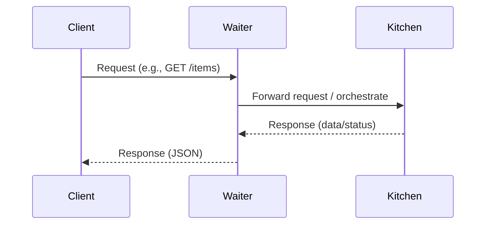

# API Rest

## API (Application Programming Interface)

Is a set of protocols and definitions used in development or integration of an application.

Basically the api is a contract of how the data will be sent and which responses we will receive when specific data is requested.

Ex: Client -> Waiter(API) -> Kitchen (Server)



## REST (Representational State Transfer)

Is a set of rules and recommendations so the api is not too complex and follow a standard.

Basically we ask to an API which is it's _state_ and it _returns_ a _representation_ of it in a data _transfer_.

The asking is made requesting an _URI (Uniform Resource Identifier)_ is known as an endpoint, route or resource like http://localhost:5000/resource/1

The transfer is made usings _HTTP ( Hyper Text Transfer Protocol)_

### Constraints

- **Client-Server**: Separation between client and server, so our system is portable to use different technologies for Web and mobile.
- **Stateless**: Each request made to the server should contain all information so the server can understand and respond the request. The server does not remember that the client was authenticated on previous session, is necessary to send also the session to the next request.
- **Cacheable**:
- **Layered System**:
- **Code on demand (optiona)**:

### Verbs

- GET
- POST
- PUT
- DELETE
- HEAD
- OPTIONS

### Status Codes

- 2\*\*: Is Ok
- 4\*\*: You made a mistake
- 5\*\*: Server is broken

### Request

```sh
curl -X http://localhost:5000/resource/1
```

## RESTful

RESTful means following or implementing a set of standards known as _REST_.
