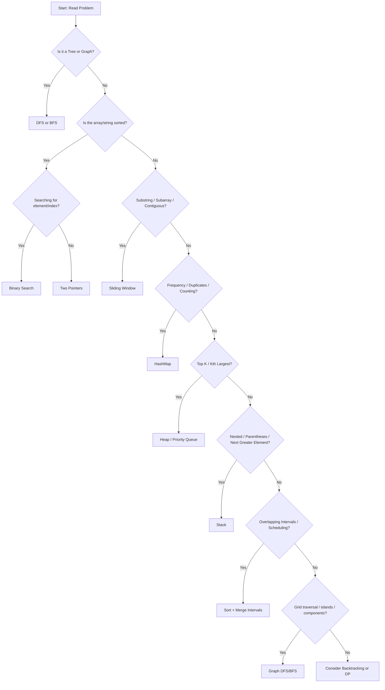

# LeetCode Practice Guide

- Pattern recognition
- Practice problems

## Pattern recognition

## Practice problems

| Category        | Problem                                        | Difficulty | Link                                                                          |
| --------------- | ---------------------------------------------- | ---------- | ----------------------------------------------------------------------------- |
| HashMap         | Two Sum                                        | Easy       | https://leetcode.com/problems/two-sum/                                        |
| HashMap         | Valid Anagram                                  | Easy       | https://leetcode.com/problems/valid-anagram/                                  |
| HashMap         | Group Anagrams                                 | Medium     | https://leetcode.com/problems/group-anagrams/                                 |
| Two Pointers    | Valid Palindrome                               | Easy       | https://leetcode.com/problems/valid-palindrome/                               |
| Two Pointers    | Container With Most Water                      | Medium     | https://leetcode.com/problems/container-with-most-water/                      |
| Two Pointers    | 3Sum                                           | Medium     | https://leetcode.com/problems/3sum/                                           |
| Sliding Window  | Best Time to Buy and Sell Stock                | Easy       | https://leetcode.com/problems/best-time-to-buy-and-sell-stock/                |
| Sliding Window  | Longest Substring Without Repeating Characters | Medium     | https://leetcode.com/problems/longest-substring-without-repeating-characters/ |
| Sliding Window  | Longest Repeating Character Replacement        | Medium     | https://leetcode.com/problems/longest-repeating-character-replacement/        |
| Stack           | Valid Parentheses                              | Easy       | https://leetcode.com/problems/valid-parentheses/                              |
| Stack           | Daily Temperatures                             | Medium     | https://leetcode.com/problems/daily-temperatures/                             |
| Binary Search   | Binary Search                                  | Easy       | https://leetcode.com/problems/binary-search/                                  |
| Binary Search   | Search in Rotated Sorted Array                 | Medium     | https://leetcode.com/problems/search-in-rotated-sorted-array/                 |
| Trees (DFS/BFS) | Maximum Depth of Binary Tree                   | Easy       | https://leetcode.com/problems/maximum-depth-of-binary-tree/                   |
| Heap            | Kth Largest Element in an Array                | Medium     | https://leetcode.com/problems/kth-largest-element-in-an-array/                |
| Graph (DFS/BFS) | Number of Islands                              | Medium     | https://leetcode.com/problems/number-of-islands/                              |
| Intervals       | Merge Intervals                                | Medium     | https://leetcode.com/problems/merge-intervals/                                |
